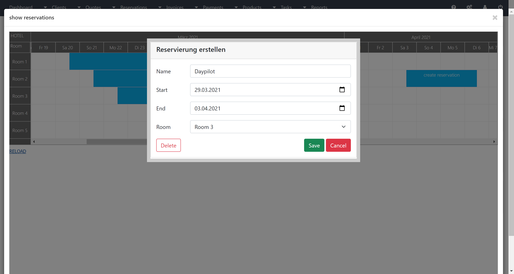
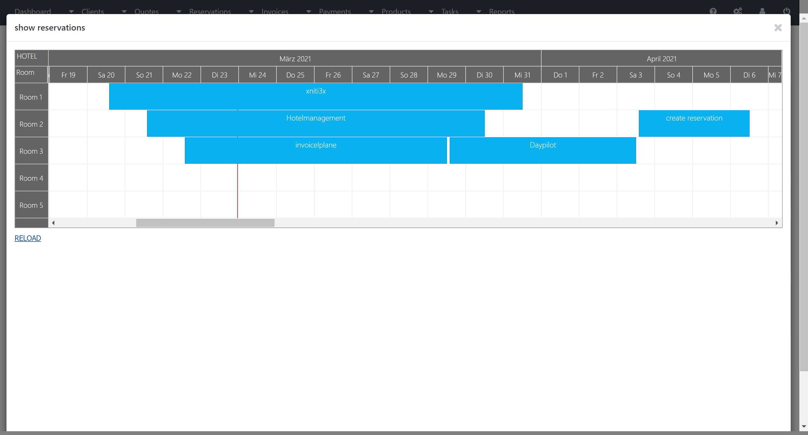

how to build it:
 composer install or composer install --ignore-platform-reqs
 this project dose not run with node version > 14.
 nvm install node v14
 npm install
 npm install -g grunt
  yarn build

  
  
  
  
  

