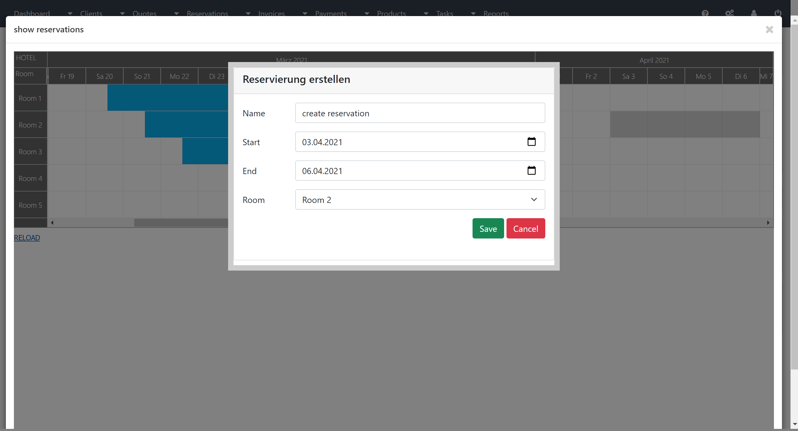

how to build it:
 composer install or composer install --ignore-platform-reqs
 this project dose not run with node version > 12.
 nvm install node v12
 npm install
 npm install -g grunt
  yarn build
  to install it manually
  mkdir dep && cd dep
  wget https://github.com/InvoicePlane/InvoicePlane/releases/download/v1.5.11/v1.5.11.zip
  php -S localhost:8080 to start the server and view on browser.
  rename ip_config_org.php file to ipconfig.php
  open the ipconfig.php and set IP_URL parameter to your domainname for example https://localhost:8080 

  
  
  
  
  

