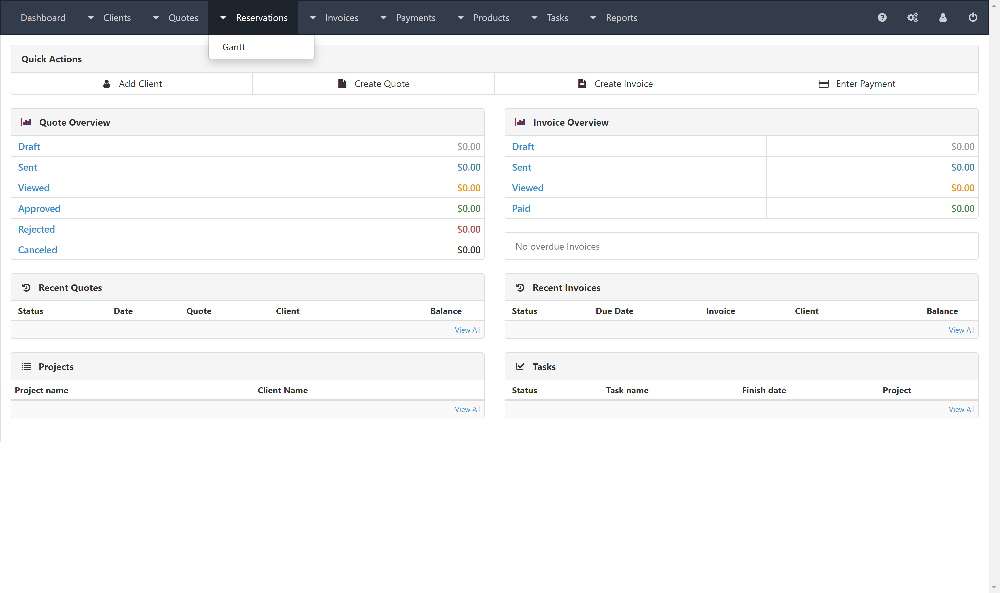

  
How to install:
  PHP version lower than 8
  composer install
  nnode version 12 or 14 , npm version  6 - 8
  npm install
  yarn install 
  grunt build
  rename the ipconfigEXAMPLE.php to ipconfig.php 
  open ipconfig.php and edit line 8 set IP_URL= to your domain for example http://localhost:8080
  make sure the styles folder exists still under assets

  
  

